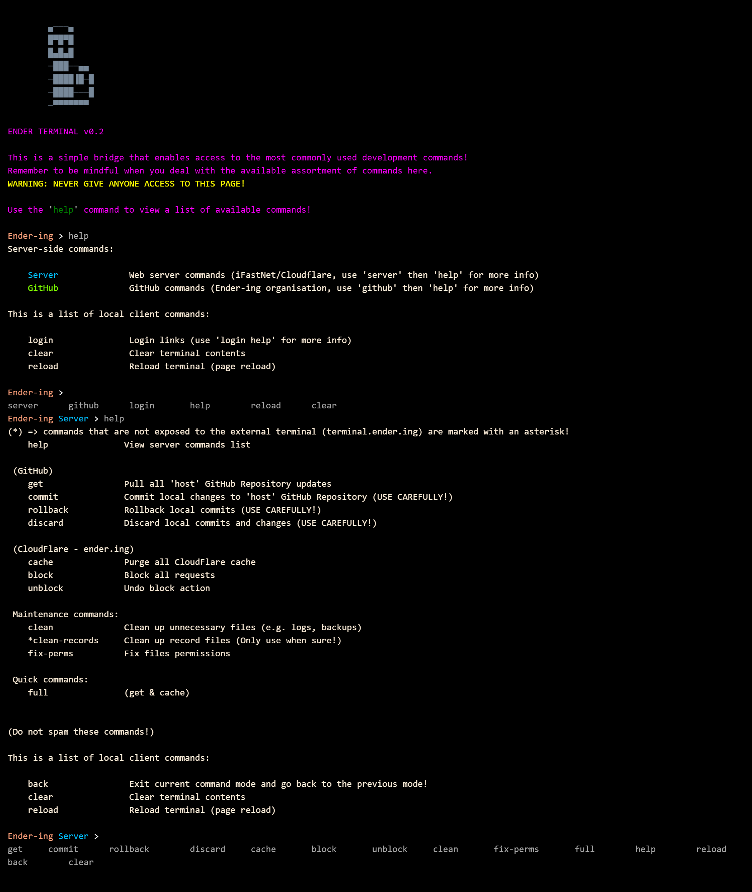

# Server Updates

:::note
This documentation is meant to instruct individuals with access to the
[server terminal](https://terminal.ender.ing/) and [private repositories](./../intro.md#projects)!
:::

Any and all changes made to the website must be pushed into the [`host` GitHub Repository](https://github.com/Ender-ing/host/).

:::note
If you do not have access to that repository, but still wish to contribute, you may ask the maintainers to accept your
contribution in the dedicated public repository related to your contribution, so they may build a new host codebase.
:::

After the commit is accepted, you may use the server terminal to publish the changes.

## Server Terminal

After logging into the [server terminal](https://terminal.ender.ing/), you may use the most fitting command to
publish changes:

### Server-side changes

If the changes within the codebase only relate to server-side code, you may use the `get` command to fetch changes.

### Client-side changes

If the changes within the codebase affect client-side code (*JavaScript, CSS, Display files, etc.*), you may use
the `full` command to fetch changes and purge the global cache.

:::tip
If you believe that the client-side changes are not large, or in case of server-side updates, you may just use
the `get` command, without purging the global cache.
:::

## Versioning

:::important
Any changes to the codebase of a service/root directory should be accompanied by a version increment!
:::
